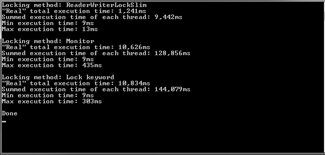

# ReaderWriterLockSlimPerf
Quick spike to test multithreaded locking perf.

Spawns 1000 tasks that aquire a lock, sleep 10ms, and then release the lock.

This only tests the read lock of the `ReaderWriterLockSlim`.

